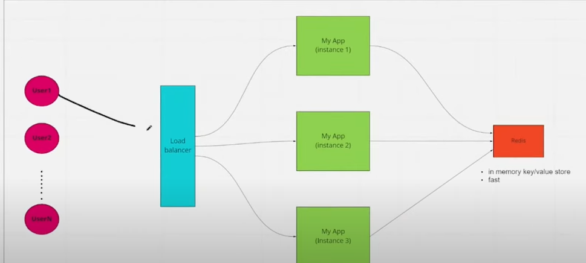

# spring-boot-redis
This repo is explains how we can use redis with spring boot

# consider we are using session based authentication.

let us say we have 1 instance of service running.
when we login to application, spring will create a context(i.e local in memory variable) which holds the session id.
after succesful login, this session id is sent to the browser as cookie.

for the next api call, it will take session from cookie, so server will identify the based on session id, if the user is valid.

# problem 1

say user is authenticated and for some reason we had to restart the server then the context where spring 
session details are stored will be loosed as it is a local variable. now we need to ask the user to provide username/passwordt
to authenticate again.

# problem 2

# since we didn;t implement load balancer, we will login to application
# now restart the application, now refresh application it will not ask for password, as we are storing session data in redis